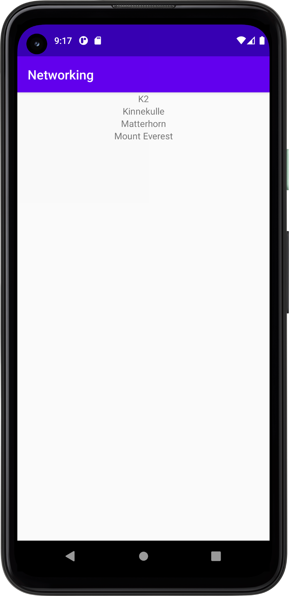

För att skapa en recyclerview lades följande rad kod till i `actvity_main.xml`
```
<androidx.recyclerview.widget.RecyclerView
android:layout_width="match_parent"
android:layout_height="match_parent"
android:id="@+id/recycler_view"  />
```
samt följande rad kod i `MainActivity.java` i "onCreate"-metoden.
```
recyclerView = findViewById(R.id.recycler_view);
```

Efter det skapades en ArrayList av typen Mountain i och med detta skapade jag en ny klass som är av typen Mountain så att ArrayListen kan fyllas med
Mountain-objekt
```
private ArrayList<Mountain> mountains;
```
I klassen mountain skapade jag de attribut som varje berg kommer att ha, jag följde Json-datan och formade klassen på följande sätt:
(Jag skapade ytterliggare en klass, auxdata som tar en länk och en bild men det anser jag överflödigt att förjupa mig i)
```
public class Mountain {
    @SerializedName("ID")
    private String id;
    private String name;
    private String type;
    private String company;
    private String location;
    private String category;
    private int size;
    private int cost;
    private auxdata auxdata;
```
Jag skapade en "recyclerwievadapter" som en medlemsvariabel med följande kod i `MainActvity.java`
```
private MountainAdapter adapter;
```

För att skapa en recyclerviewadapter och en recyclerviewholder skapade jag en ny klass kallad `MountainAdapter.java`
i denna klass skapade jag de metoder som krävdes samt hänvisade till en xml-fil som agerar mall till hur min recyclerview ska presentera data. 
Min mall ligger i `list_item.xml` och är uppbyggd på följande sätt:
```
<?xml version="1.0" encoding="utf-8"?>
<androidx.constraintlayout.widget.ConstraintLayout xmlns:android="http://schemas.android.com/apk/res/android"
    android:layout_width="match_parent"
    android:layout_height="match_parent"
    >
    <TextView
        android:id="@+id/mountain_name"
        android:layout_width="match_parent"
        android:layout_height="match_parent"
        android:textAlignment="center"
        />

</androidx.constraintlayout.widget.ConstraintLayout>
```
montainadapter klassen är uppbyggd med följande kod där jag hänviar till "list_item" vilket är min mall för layouten

```
public class MountainAdapter extends RecyclerView.Adapter<MountainAdapter.MountainViewHolder>{
private List<Mountain> mountains;
public MountainAdapter(List<Mountain> mountains) {
this.mountains = mountains;
}

    @NonNull
    @Override
    public MountainViewHolder onCreateViewHolder(@NonNull ViewGroup parent, int viewType) {
        View view = LayoutInflater.from(parent.getContext()).inflate(R.layout.list_item,parent,false);
        return new MountainViewHolder(view);
    }

    @Override
    public void onBindViewHolder(@NonNull MountainViewHolder holder, int position) {
        Mountain mountain = mountains.get(position);
        holder.mountain_name.setText(mountain.getName());
    }

    @Override
    public int getItemCount() {
        return mountains.size();
    }

    public class MountainViewHolder extends RecyclerView.ViewHolder {
        private TextView mountain_name;
        public MountainViewHolder(@NonNull View itemView) {
            super(itemView);
            mountain_name = itemView.findViewById(R.id.mountain_name);
        }
    }
}
```
Jag bytte ut URL i denna rad som befinner sig i `MainActivity.java`
```
private final String JSON_URL = "https://mobprog.webug.se/json-api?login=brom";
```
För att parsa Json-datan och visa den i min recyclerview skrev jag följande kod:

```
       @Override
    public void onPostExecute(String json) {

        Log.d("MainActivity", json);
        Gson gson = new Gson();
        Type type = new TypeToken<ArrayList<Mountain>>() {}.getType();
        mountains = gson.fromJson(json, type);
        adapter = new MountainAdapter(mountains);
        recyclerView.setAdapter(adapter);
        recyclerView.setLayoutManager(new LinearLayoutManager(getApplicationContext()));
        adapter.notifyDataSetChanged();

    }
```



